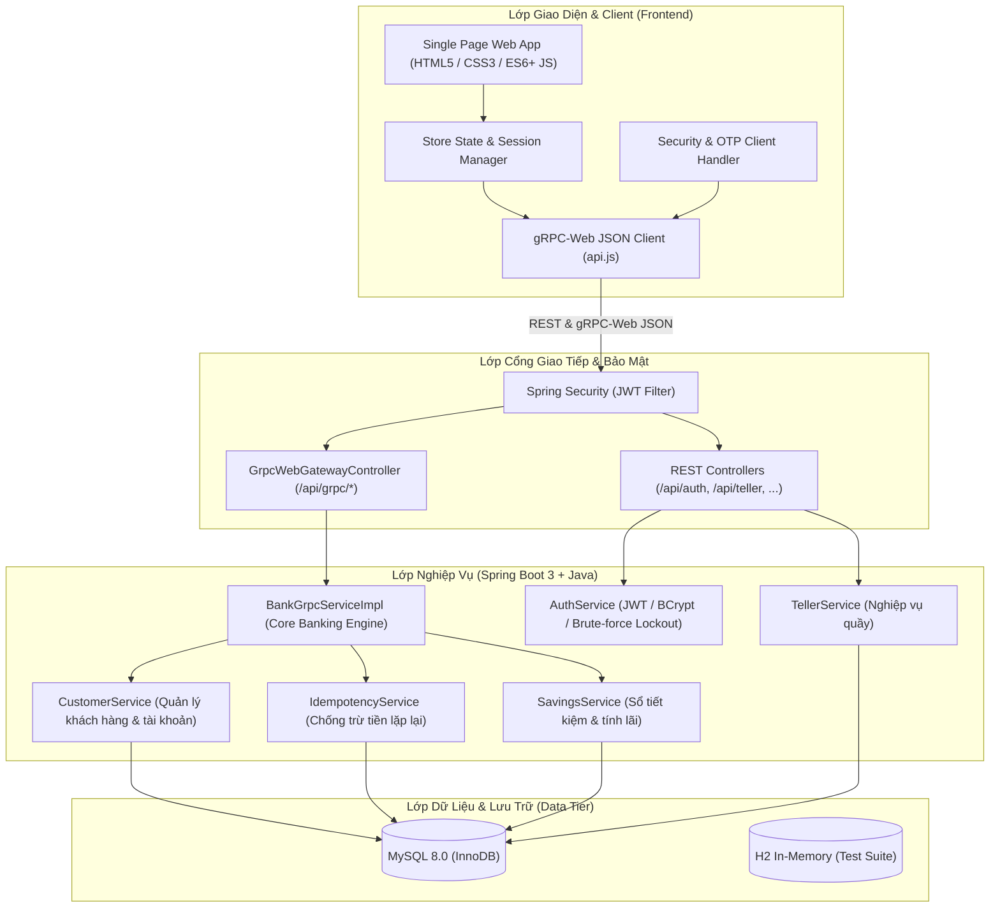

# 🏦 QuangTrung Bank - Hệ Thống Mô Phỏng Ngân Hàng Số & Core Banking

> **Đồ án Chuyên ngành 2 (PRJ2)**  
> Hệ thống mô phỏng Ngân hàng lõi (Core Banking) và Ngân hàng số đa kênh (Omni-channel Digital Banking), tích hợp kiến trúc giao tiếp lai **RESTful API + gRPC-Web Gateway**, bảo mật xác thực **JWT + OTP**, và cơ chế chống trùng lặp giao dịch **Idempotency**.

---

## 📑 Mục Lục
1. [Giới Thiệu](#-giới-thiệu)
2. [Kiến Trúc & Công Nghệ](#-kiến-trúc--công-nghệ)
3. [Tính Năng Chính](#-tính-năng-chính)
4. [Tài Khoản Mẫu Trải Nghiệm](#-tài-khoản-mẫu-trải-nghiệm)
5. [Cấu Trúc Thư Mục](#-cấu-trúc-thư-mục)
6. [Hướng Dẫn Cài Đặt & Khởi Chạy](#-hướng-dẫn-cài-đặt--khởi-chạy)
7. [Kiểm Thử (Testing)](#-kiểm-thử-testing)
8. [Định Hướng Phát Triển](#-định-hướng-phát-triển)

---

## 🌟 Giới Thiệu

**QuangTrung Bank** là dự án mô phỏng toàn diện hoạt động của một ngân hàng thương mại hiện đại:
- **Khách hàng cá nhân**: Trải nghiệm ứng dụng Internet Banking trực quan với các thao tác truy vấn số dư, chuyển tiền nội bộ, mở/tất toán sổ tiết kiệm, sao kê tài khoản và nhận thông báo biến động số dư.
- **Giao dịch viên (Teller)**: Thực hiện các nghiệp vụ tại quầy như nạp tiền (Deposit), rút tiền (Withdrawal), mở tài khoản và xử lý rút tiền bằng mã ATM không cần thẻ.
- **Quản trị viên (Admin)**: Giám sát toàn bộ hoạt động hệ thống, quản lý lãi suất tiết kiệm, hạn mức và nhật ký kiểm toán (Audit Logs).

---

## 🏗 Kiến Trúc & Công Nghệ

### 1. Sơ đồ kiến trúc tổng quan



### 2. Công nghệ sử dụng

| Tầng (Layer) | Công nghệ / Thư viện | Mô tả |
| :--- | :--- | :--- |
| **Backend Core** | Spring Boot 3.2.2, Java 17/25 | Xây dựng dịch vụ backend hiệu năng cao |
| **Security** | Spring Security 6, JJWT 0.12.6, BCrypt | Xác thực Stateless JWT, phân quyền RBAC, mã hóa mật khẩu |
| **Giao tiếp RPC** | gRPC 1.62.2, Protocol Buffers 3, gRPC-Web | Chuẩn hóa interface dữ liệu, giao tiếp tối ưu tốc độ |
| **Database & ORM** | MySQL 8.0, Spring Data JPA, Hibernate, H2 | Quản lý giao dịch ACID, lưu trữ dữ liệu bền vững |
| **Frontend** | HTML5, Vanilla CSS3 (Custom Design System), ES6+ JS | Giao diện Single Page App mượt mà, phản hồi thời gian thực |
| **Kiểm thử** | JUnit 5, Mockito, Spring Boot Test | Bộ test suite tự động kiểm thử nghiệp vụ và tích hợp |

---

## ⚡ Tính Năng Chính

### 1. Bảo mật & Xác thực (Security & Identity)
- **JWT Authentication**: Cấp phát và xác thực token JWT không lưu trạng thái phiên trên server.
- **Mã hóa BCrypt**: Toàn bộ mật khẩu người dùng được hash với độ trễ tính toán an toàn (cost factor 12).
- **Phân quyền Role-based (RBAC)**: Phân tách rõ rệt quyền giữa `CUSTOMER`, `TELLER`, và `ADMIN`.
- **Chống dò mật khẩu (Brute-force Protection)**: Tự động khóa tài khoản tạm thời khi đăng nhập sai nhiều lần liên tiếp.

### 2. Nghiệp vụ Ngân hàng số (Customer Internet Banking)
- **Quản lý tài khoản**: Xem số dư khả dụng, số tài khoản, chi tiết thông tin cá nhân.
- **Chuyển khoản an toàn (Money Transfer)**:
  - Tra cứu tự động tên người thụ hưởng qua số tài khoản.
  - Xác thực hai lớp bằng **mã OTP** với thời hạn hiệu lực (TTL 5 phút).
  - Áp dụng cơ chế **Idempotency Key**: Ngăn ngừa hoàn toàn nguy cơ trừ tiền 2 lần (Double-Spending) khi kết nối mạng chập chờn hoặc người dùng ấn nút nhiều lần.
- **Tiết kiệm trực tuyến (Online Savings)**:
  - Mở sổ tiết kiệm kỳ hạn từ 1 đến 36 tháng hoặc không kỳ hạn.
  - Áp dụng biểu lãi suất tự động, tính lãi dự kiến khi đến hạn.
  - Hỗ trợ tất toán trước hạn hoặc quay vòng vốn.
- **Lịch sử giao dịch & Sao kê**:
  - Tra cứu lịch sử nạp, rút, chuyển tiền, nhận tiền.
  - Bộ lọc đa tiêu chí theo thời gian, loại giao dịch và trạng thái.
  - Xuất sao kê tài khoản ngân hàng chi tiết.
- **Thông báo biến động số dư (Notifications)**: Cập nhật thông báo tức thì khi tài khoản có biến động số dư.

### 3. Nghiệp vụ Quầy (Teller Services)
- Nạp tiền (Deposit) và Rút tiền (Withdrawal) vào tài khoản khách hàng.
- Mở tài khoản thanh toán và liên kết hồ sơ khách hàng mới.
- Hỗ trợ xử lý mã rút tiền ATM không cần thẻ (`AtmCode`).
- Ghi nhật ký kiểm toán (`AuditLog`) phục vụ công tác thanh tra, hậu kiểm.

### 4. Quản trị hệ thống (Admin Portal)
- Giám sát tổng quan hệ thống (tổng số dư, số lượng người dùng, khối lượng giao dịch).
- Cấu hình bảng lãi suất tiền gửi tiết kiệm.
- Xem toàn bộ nhật ký hệ thống và audit logs.

---

## 👥 Tài Khoản Mẫu Trải Nghiệm

Hệ thống đã nạp sẵn dữ liệu ban đầu (*Seed Data*) trong CSDL:

> 🔑 **Mật khẩu chung cho tất cả tài khoản mẫu**: `Abc@1234`

| Vai trò (Role) | Tên đăng nhập | Số điện thoại | Số tài khoản / Mã NV | Số dư ban đầu |
| :--- | :--- | :--- | :--- | :--- |
| **Khách hàng 1** | `customer1` | `0901234567` | `1000123456` | 250,000,000 VND |
| **Khách hàng 2** | `customer2` | `0987654321` | `1000987654` | 85,500,000 VND |
| **Giao dịch viên** | `teller1` | `0933445566` | `GDV001` | *N/A (Nghiệp vụ quầy)* |
| **Quản trị viên** | `admin` | `0900000000` | *N/A* | *N/A (Quản trị hệ thống)* |

---

## 📂 Cấu Trúc Thư Mục

```text
MoPhongHeThongNganHang/
├── backend/                                # Mã nguồn Spring Boot Backend
│   ├── src/
│   │   ├── main/
│   │   │   ├── java/com/quangtrungbank/
│   │   │   │   ├── config/                # Cấu hình Spring Security, CORS, WebMvc
│   │   │   │   ├── controller/            # REST API & GrpcWebGatewayController
│   │   │   │   ├── dto/                   # Data Transfer Objects (Request/Response)
│   │   │   │   ├── entity/                # JPA Entities (User, Account, Transaction,...)
│   │   │   │   ├── grpc/                  # gRPC Service & Stubs implementation
│   │   │   │   ├── repository/            # Spring Data JPA Repositories
│   │   │   │   └── service/               # Core Banking Services & Logic
│   │   │   ├── proto/                     # Protocol Buffer (.proto) service definitions
│   │   │   └── resources/
│   │   │       ├── application.properties # Cấu hình kết nối MySQL, JPA, Logging
│   │   │       ├── schema.sql             # Cấu trúc bảng CSDL
│   │   │       └── data.sql               # Dữ liệu hạt giống (Seed Data)
│   │   └── test/                          # Unit & Integration Tests (JUnit 5 + H2)
│   ├── pom.xml                            # Quản lý dependencies & Protobuf plugin
│   └── mvnw / mvnw.cmd                    # Maven Wrapper
├── js/                                    # Mã nguồn JavaScript Client (Frontend)
│   ├── api.js                             # Xử lý gọi REST API & gRPC-Web JSON
│   ├── app.js                             # Điều hướng chính & khởi tạo ứng dụng
│   ├── auth.js                            # Xử lý Đăng nhập / Đăng xuất / Session
│   ├── customer.js                        # Giao diện & logic nghiệp vụ Khách hàng
│   ├── teller.js                          # Giao diện & nghiệp vụ Giao dịch viên
│   ├── admin.js                           # Giao diện & nghiệp vụ Quản trị viên
│   ├── security.js                        # Xử lý OTP & mã hóa phía client
│   ├── store.js                           # Quản lý State tập trung
│   └── reports.js                         # Xuất báo cáo & biểu đồ
├── styles/                                # Tệp định kiểu CSS giao diện
├── index.html                             # Giao diện chính của ứng dụng (SPA)
├── PROJECT_OVERVIEW.md                    # Báo cáo tổng quan chi tiết dự án
├── FIXES_APPLIED.md                       # Ghi chú kỹ thuật về các bản vá đã áp dụng
└── README.md                              # Tài liệu hướng dẫn dự án
```

---

## 🚀 Hướng Dẫn Cài Đặt & Khởi Chạy

### 1. Yêu cầu môi trường
- **Java**: JDK 17 hoặc mới hơn (khuyến nghị JDK 17 hoặc 21 LTS).
- **MySQL**: Phiên bản 8.0 trở lên.
- **Trình duyệt**: Google Chrome, Microsoft Edge, Firefox hoặc Safari bản mới nhất.
- *(Tùy chọn)* **VS Code** với tiện ích mở rộng *Live Server* để chạy Frontend.

---

### 2. Cấu hình Cơ sở dữ liệu (MySQL)
1. Mở MySQL Server và đảm bảo dịch vụ đang chạy trên cổng mặc định `3306`.
2. Kiểm tra thông tin tài khoản đăng nhập trong tệp [application.properties](file:///backend/src/main/resources/application.properties):
   ```properties
   spring.datasource.url=jdbc:mysql://localhost:3306/quangtrung_bank?useSSL=false&serverTimezone=Asia/Ho_Chi_Minh&allowPublicKeyRetrieval=true&createDatabaseIfNotExist=true&characterEncoding=UTF-8
   spring.datasource.username=root
   spring.datasource.password=123456
   ```
   *(Thay đổi `username` và `password` phù hợp với cấu hình máy tính của bạn).*
3. Cơ sở dữ liệu `quangtrung_bank` sẽ được tự động tạo và khởi tạo bảng + dữ liệu mẫu thông qua `schema.sql` và `data.sql`.

---

### 3. Khởi chạy Backend (Spring Boot)
Di chuyển vào thư mục `backend` và chạy lệnh:

- **Trên Windows (Command Prompt hoặc PowerShell)**:
  ```powershell
  cd backend
  .\mvnw.cmd clean spring-boot:run
  ```

- **Trên Linux / macOS**:
  ```bash
  cd backend
  ./mvnw clean spring-boot:run
  ```

Khi màn hình console hiển thị:
```text
Started QuangTrungBankApplication in X.XXX seconds (process running for X.XXX)
```
Backend đã sẵn sàng nhận kết nối tại địa chỉ: `http://localhost:8080`.

---

### 4. Khởi chạy Frontend
Bạn có thể mở giao diện bằng 1 trong các cách sau:

- **Cách 1: Sử dụng Live Server trong VS Code (Khuyên dùng)**
  1. Mở thư mục dự án trên VS Code.
  2. Chuột phải vào tệp [index.html](file:///index.html) chọn **Open with Live Server**.
  3. Ứng dụng sẽ tự động mở tại `http://127.0.0.1:5500` hoặc tương đương.

- **Cách 2: Sử dụng Python HTTP Server**
  ```bash
  # Chạy tại thư mục gốc dự án
  python -m http.server 3000
  ```
  Truy cập vào trình duyệt: `http://localhost:3000`.

- **Cách 3: Mở trực tiếp**
  Nhấp đúp chuột vào tệp [index.html](file:///index.html) để mở trực tiếp trên trình duyệt.

---

## 🧪 Kiểm Thử (Testing)

Dự án bao gồm bộ kiểm thử tự động toàn diện (Unit Test & Integration Test) sử dụng **H2 Database In-Memory**:

Chạy toàn bộ test suite từ thư mục `backend`:
```powershell
cd backend
.\mvnw.cmd test
```

### Các kịch bản kiểm thử tiêu biểu:
- `BankGrpcTransferIntegrationTest`: Kiểm thử tích hợp luồng chuyển tiền qua cổng gRPC-Web Gateway.
- `IdempotencyTest`: Kiểm thử khả năng chịu tải và chống trừ tiền 2 lần khi gửi trùng lặp Idempotency-Key.
- `SavingsServiceTest`: Kiểm tra logic mở sổ, tính lãi suất chính xác và tất toán tiền gửi.
- `StatementServiceTest` & `TransactionHistoryTest`: Kiểm tra lọc, phân trang và truy vấn sao kê giao dịch.

---

## 🔮 Định Hướng Phát Triển

1. **Kiến trúc Microservices (Đồ án 3)**:
   - Tách tách các dịch vụ lõi thành các Microservice độc lập: *Auth Service*, *Account Service*, *Transfer Service*, *Notification Service*.
   - Triển khai **API Gateway** và Message Broker (**Apache Kafka / RabbitMQ**) để xử lý giao dịch bất đồng bộ.
2. **Công nghệ Fintech nâng cao (Đồ án Tốt nghiệp)**:
   - Tích hợp công nghệ nhận diện khuôn mặt và định danh điện tử **eKYC**.
   - Ứng dụng mô hình **AI/Machine Learning** phát hiện gian lận giao dịch bất thường (Fraud Detection).
   - Đóng gói container hóa toàn diện với **Docker** và điều phối hạ tầng trên **Kubernetes (K8s)**.

---

## 👨‍💻 Thông Tin Dự Án
- **Môn học**: Đồ án Chuyên ngành 2 (PRJ2)
- **Đề tài**: Mô phỏng Hệ thống Ngân hàng (QuangTrung Bank)
- **Phiên bản**: v1.0.0
